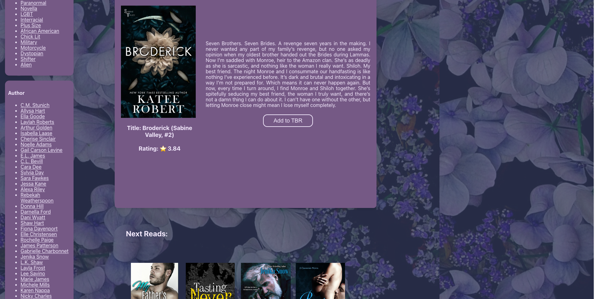

# Love Library
The one stop "library" of romance novels across multiple genres and authors.

## Overview
Love Library is an interactive "Good Reads" like application based solely on romance novels ranging from contemporary, to paranormal to lifestyle specific genres. This app allows you to "Find your next read" or reconnect with books forgotten about.

### Screenshoot

## Features
Filtering by Author and Genre
The ability to save a books and allowing them to persist past refreshing
An extensive list of the fraction of books the creator has read
Multi-page application using React Router
Responsive design for various screen sizes
End-to-end testing with Cypress
Data fetching using the Fetch API
Custom-built REST API
PostgreSQL server for data storage

## Demo

# Installation
To run Love Library  locally, you will need to set up the backend. Instructions for this are available in the backend repository. Alternatively, you can check out our live deployment. Note that the live backend server may have a slow startup time if it has been idle.

  git clone git@github.com:LISims88/love-library.git
  cd love-library
  npm install
  npm start
  The server should be running on: localhost:3000

# Running Tests
To run our Cypress tests, run the following command

  npx cypress open

From there the Cypress test runner will run. For more information on Cypress, check out the Cypress documentation

### Context
Love Library was developed in a little over one week at the Turing School of Software & Design. The project was a solo effort that was completed in approximately 50 programming hours. The primary goal was to build a comprehensive full-stack application.

### Lessons Learned
The primary objective was to create a full-stack application utilizing React for the frontend and Express, Knex, and PostgreSQL for the backend.  Key takeaways included understanding the importance of prioritizing the MVP features and learning a new CSS styling.

This project was a major lesson in strengthening my skills as Front End Developer with the Possibility of moving more towards Full Stack.

### Author
Lydia Sims - @LISims88
